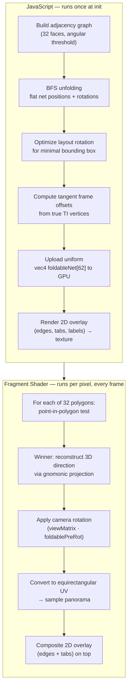

<div align="center">

# dome-mapper

**Equirectangular panorama viewer using a GPU raycaster projecting onto the inside of a unit sphere.**

A single-file browser app that loads equirectangular images and videos and renders them as an immersive spherical projection. The fragment shader casts rays from the origin against a unit sphere and maps the equirectangular texture using spherical coordinates — no mesh geometry needed.


</div>

---

## Contents

- [How It Works](#how-it-works)
- [Usage](#usage)
- [Controls](#controls)
  - [Mouse / Touch](#mouse--touch)
  - [Keyboard](#keyboard)
  - [UI Panels](#ui-panels)
  - [Y / P / R Sliders](#y--p--r-sliders)
- [Animation Editor](#animation-editor)
  - [Data Model](#data-model)
  - [Keyframe Attributes](#keyframe-attributes)
  - [Timeline Interactions](#timeline-interactions)
  - [Pin Visual States](#pin-visual-states)
  - [Playback](#playback)
  - [Duration Scaling](#duration-scaling)
  - [Architecture](#architecture)
  - [SQUAD Quaternion Spline — Technical Deep Dive](#squad-quaternion-spline--technical-deep-dive)
- [Projection Modes](#projection-modes)
  - [Base projections](#base-projections)
  - [Polyhedron projection modes](#polyhedron-projection-modes-10-geometries--preview--foldable)
  - [Polyhedron Preview Modes — Technical Deep Dive](#polyhedron-preview-modes--technical-deep-dive)
  - [Stereographic Projection — Technical Deep Dive](#stereographic-projection--technical-deep-dive)
  - [Foldable Buckyball-32 Projection — Technical Deep Dive](#foldable-buckyball-32-projection--technical-deep-dive)
  - [Foldable Rhombic-30 Projection — Technical Deep Dive](#foldable-rhombic-30-projection--technical-deep-dive)
- [Export](#export)
  - [DPI Setting](#dpi-setting)
  - [ICC Profiles](#icc-profiles)
  - [SVG Cutline Export](#svg-cutline-export)
  - [Pixel-Perfect Foldable Drag](#pixel-perfect-foldable-drag)
  - [PDF Export](#pdf-export)
- [Features](#features)
- [Project Structure](#project-structure)
  - [Unified Net Layouter](#unified-net-layouter)
- [Technical Notes](#technical-notes)
  - [Texture Caching (IndexedDB)](#texture-caching-indexeddb)
- [Roadmap](#roadmap)
  - [Technical Roadmap Notes](#technical-roadmap-notes)
- [Acknowledgements](#acknowledgements)
- [License](#license)

---

## How It Works

For each screen pixel the fragment shader:

1. Computes a **ray direction** based on the active projection mode — one of 25: equirectangular, perspective, azimuthal equidistant, azimuthal collage, stereographic, plus 10 polyhedra (dodec-12, rhombic-12, truncoct-14, ico-20, pentagonal-24, rhombic-30, buckyball-32, deltoidal-60, pentahex-60, rhombicosi-62) each with a preview and foldable mode
2. Applies a **quaternion-derived rotation matrix** (controlled by mouse or keyboard) to orient the ray
3. Optionally applies **horizon leveling** via a second quaternion
4. Converts the ray direction to **spherical coordinates** (θ, φ)
5. Maps those to **equirectangular UV** coordinates: `u = atan2(z, x) / 2π + 0.5`, `v = asin(y) / π + 0.5`
6. Samples the loaded texture (blending LINEAR and NEAREST filtered versions via the Pixelate slider) or shows a checkerboard test pattern
7. Composites **magnifier lens**, **globe overlay**, and **grid** on top

No sphere geometry is created — the projection is purely analytical in the shader.

## Usage

```bash
# No dependencies, no build step.
open index.html
```

1. Open in a browser
2. Drop an equirectangular panorama image or video (or click "browse")
3. Look around with mouse or keyboard

When served over HTTP the viewer auto-loads a default video (or image as fallback). A checkerboard test pattern with meridian/equator highlights is shown when no media is loaded.

## Controls

### Mouse / Touch

| Input | Action |
|---|---|
| Drag | Look around (quaternion trackball) |
| Shift + Drag | Roll rotation |
| Scroll wheel | Adjust FOV / zoom (projection-dependent) |
| Two-finger drag | Both fingers hold their texture points; implicitly adjusts FOV/zoom (perspective, stereographic, azimuthal) |
| Pinch (equirectangular) | Primary finger drags; second finger ignored |
| Click / tap (no drag) | Play / pause video |
| Double-click / double-tap | Fly-to: animate camera so clicked point becomes center |
| Double-tap slider | Reset slider to default value |

### Keyboard

| Key | Action |
|---|---|
| `A` / `D` (or Numpad `4` / `6`) | Yaw (rotate left/right) |
| `W` / `S` (or Numpad `8` / `2` / `5`) | Pitch (rotate up/down) |
| `Q` / `E` (or Numpad `7` / `9`) | Roll |
| `←` / `→` | Cycle through cached files |
| `↑` / `↓` | Cycle through projection methods |
| `X` | Cycle grid overlay (Off → Tex → View) |
| `G` | Toggle globe overlay |
| `L` | Toggle level / horizon mode |
| `M` | Toggle magnifier |
| `Space` | Play / pause video (when video is loaded) |

Held keys debounce briefly, then accelerate exponentially.

### UI Panels

Both the **controls panel** (top-right) and the **file list** (top-left) can be collapsed to a ☰ icon via their toggle button, maximizing viewport space. Click the icon again to expand.

### Y / P / R Sliders

| Input | Action |
|---|---|
| Drag slider | Set yaw, pitch, or roll directly (Euler degrees) |
| Double-click slider | Reset that axis to 0° |

Camera sliders map directly to `quatToEulerDeg` output (Tait-Bryan YXZ: yaw→yaw, pitch→pitch, roll→roll). Leveling sliders **swap pitch and roll** because the level quaternion operates in texture space (applied as `levelMatrix * dir` during equirectangular sampling), where the intuitive physical axes are transposed relative to the camera-space Euler decomposition.

## Animation Editor

The animation panel lets you create keyframe-driven camera animations that interpolate between saved projection states.

### Data Model

Each source file can have multiple **animations**, persisted in IndexedDB alongside the projection config:

```
Animation
├── name (string)
├── duration (seconds)
├── loop (boolean)
├── projectionModeIndex (integer)
└── keyframes[]
    ├── time (seconds)
    ├── quat [x, y, z, w]          ← camera orientation (SQUAD spline)
    ├── fovDeg, pixelate, ...       ← numeric params (linear lerp)
    └── globeVisible, ...           ← boolean params (snap)
```

Each keyframe stores a **full projection state snapshot** — all parameters from the camera quaternion to the stereographic Scaramuzza coefficients to the globe overlay settings.

### Keyframe Attributes

| Category | Properties | Interpolation |
|---|---|---|
| Camera orientation | `quat` [x, y, z, w] | **SQUAD** — C¹-smooth spherical spline (Catmull-Rom tangents via `squadInner`, hemisphere-consistent) |
| Numeric | `fovDeg`, `pixelate`, `collageRotationDeg`, `collageFlip`, `azimuthalZoom`, `stereoD`, `stereoA0`–`stereoA3`, `globeSize`, `globeOpacity`, `globeReflect`, `buckyOverlayAlpha` | Catmull-Rom spline |
| Boolean | `globeVisible` | Snap to keyframe A |

### Timeline Interactions

| Input | Action |
|---|---|
| Single click on pin | Jump to keyframe time, apply stored projection state |
| Drag pin (not first) | Reposition keyframe in time; slider follows |
| Double-click on pin (not first) | Delete keyframe (with confirm dialog) |
| Double-click on empty space | Add new keyframe at that position |
| Hover over pin | Show `<Y°, P°, R°>` tooltip with stored camera orientation |
| Drag on empty space | Ghost pin appears immediately, showing where a new keyframe will be created |
| Scrub slider | Interpolate all attributes between surrounding keyframes |

### Pin Visual States

| State | Fill | Stroke | Condition |
|---|---|---|---|
| Default | Gold `#fb0` | `#a70` | Inactive, not hovered |
| Active | Blue `#4cf` | `#28a` | Slider is on this keyframe (±0.5% tolerance) |
| Hovered | Blue `#4cf` | `#28a` | Mouse is over this pin (enlarged radius) |
| Ghost (loop) | 50% opacity | — | Mirrors first keyframe at t=duration when loop is enabled |
| Ghost (pending) | 50% opacity | — | Preview of where a new keyframe will be added (appears on drag start) |

### Playback

- **Play/Pause** button starts real-time playback from the current slider position
- During playback, `stepAnimPlayback()` advances the slider each frame, calls `interpolateKeyframes()` to SQUAD-spline/Catmull-Rom all attributes, and updates all UI sliders
- **Loop mode**: at the end, time wraps seamlessly — fractional overshoot is preserved via `elapsed % duration` to eliminate micro-stutter at the loop boundary; the SQUAD spline uses hemisphere-consistent tangent vectors at the wrap point for C¹ continuity
- **Auto-stop**: without loop, playback stops at the last frame

### Duration Scaling

Changing the animation duration proportionally rescales all keyframe times, preserving their relative positions.

### Architecture

```
captureKeyframeState()    → snapshot all KF_PROPS + camQuat into plain object
applyKeyframeState(s)     → restore all variables + update sliders
interpolateKeyframes()    → find A/B keyframes, SQUAD for quats, Catmull-Rom for numerics
quatSquad(q0,q1,q2,q3,t)  → C¹ spherical spline between q1 and q2 using tangents from q0,q3
squadInner(qPrev,qCurr,qNext) → hemisphere-consistent tangent quaternion for SQUAD
KF_PROPS                  → getter/setter proxy bridging property names to
                             function-scoped variables (avoids eval)
stepAnimPlayback()        → advance slider from wall-clock time, call interpolate
updateProjectionSliders() → sync all slider DOM elements with current state
```

### SQUAD Quaternion Spline — Technical Deep Dive

Camera orientation between keyframes is interpolated using **SQUAD** (Spherical and Quadrangle), a C¹-smooth spherical spline that is the quaternion analogue of Catmull-Rom splines. Unlike plain SLERP (which only guarantees C⁰ continuity, creating visible speed changes at keyframes), SQUAD produces smooth acceleration through keyframes with no abrupt velocity transitions.

#### Algorithm

Given four consecutive keyframe quaternions $(q_{i-1}, q_i, q_{i+1}, q_{i+2})$ and a local parameter $t \in [0,1]$ between $q_i$ and $q_{i+1}$:

$$\text{SQUAD}(q_i, q_{i+1}, s_i, s_{i+1}, t) = \text{SLERP}\!\Big(\text{SLERP}(q_i, q_{i+1}, t),\;\text{SLERP}(s_i, s_{i+1}, t),\;2t(1-t)\Big)$$

where $s_i$ and $s_{i+1}$ are **inner quadrangle points** (tangent quaternions) computed by `squadInner()`:

$$s_i = q_i \cdot \exp\!\left(-\frac{\log(q_i^{-1} q_{i-1}) + \log(q_i^{-1} q_{i+1})}{4}\right)$$

#### Hemisphere Consistency

A critical subtlety: quaternions $q$ and $-q$ represent the same rotation, but SLERP can take the long path (~270°) instead of the short path (~90°) if the dot product is negative. The `squadInner()` implementation flips $q_{i-1}$ and $q_{i+1}$ into $q_i$'s hemisphere before computing tangent vectors, ensuring short-path interpolation at every segment boundary — including the loop wrap point where $q_{\text{last}} \to q_0$.

#### Loop Wrap

In loop mode, the spline is closed: the segment from the last keyframe back to the first uses the second-to-last keyframe as $q_{i-1}$ and the second keyframe as $q_{i+2}$, providing smooth tangent continuity across the loop boundary.

#### Numeric Attributes

Non-quaternion attributes (FOV, zoom, stereographic coefficients, etc.) use a standard **Catmull-Rom spline** with the same four-keyframe window, providing matching C¹ smoothness for all animated parameters.

---

## Projection Modes

> **25 projection modes** — cycle with the dropdown.

### Base projections

| # | Mode | Description |
|:---:|---|---|
| 0 | **Equirectangular** | Direct 2:1 equirectangular mapping; black bars when viewport aspect ≠ 2:1 |
| 1 | **Perspective** | Gnomonic projection with adjustable FOV (20°–170°); mathematically a special case of the stereographic family at D=1 |
| 2 | **Azimuthal Equidistant** | Full sphere mapped into a disc (forward pole → center, backward pole → edge) |
| 3 | **Azimuthal Collage** | Two overlapping azimuthal equidistant discs side-by-side (front/back hemispheres) with rotation, overlap blend slider (0–1), zoom (1×–10×), and auto-fit scaling |
| 4 | **Stereographic** | Generalised stereographic with Scaramuzza polynomial lens distortion; D parameter (D=2 conformal, D=1 gnomonic) and a¹–a⁴ coefficients |

### Polyhedron projection modes (10 geometries × preview + foldable)

| Geometry | Preview | Foldable | Faces |
|---|---|---|---|
| **Dodecahedron-12** | SDF-raymarched regular dodecahedron | Flat net of 12 regular pentagons | 12 |
| **Rhombic-12** | SDF-raymarched rhombic dodecahedron | Flat net of 12 congruent rhombi (70.53°/109.47°) | 12 |
| **Truncoct-14** | SDF-raymarched truncated octahedron | Flat net of 8 hexagons + 6 squares | 14 |
| **Icosahedron-20** | SDF-raymarched regular icosahedron | Flat net of 20 equilateral triangles | 20 |
| **Pentagonal-24** | SDF-raymarched pentagonal icositetrahedron | Flat net of 24 congruent irregular pentagons (4×114.8° + 1×80.8°) | 24 |
| **Rhombic-30** | SDF-raymarched rhombic triacontahedron | Flat net of 30 golden rhombi | 30 |
| **Buckyball-32** | SDF-raymarched truncated icosahedron | Flat net of 12 pentagons + 20 hexagons | 32 |
| **Deltoidal-60** | SDF-raymarched deltoidal hexecontahedron | Flat net of 60 congruent kites | 60 |
| **Pentahex-60** | SDF-raymarched pentagonal hexecontahedron | Flat net of 60 congruent irregular pentagons | 60 |
| **Rhombicosi-62** | SDF-raymarched rhombicosidodecahedron | Flat net of 20 triangles + 30 squares + 12 pentagons | 62 |

All preview modes: SDF sphere-tracing with Blinn-Phong lighting, bevelled edges, real-time rotation via Y/P/R face sliders. All foldable modes: gnomonic back-projection per face, BFS-unfolded 2D net with canvas overlay (edges, glue tabs), paper format presets, in-shader paper outline, cut line overlay, SVG/PDF export.

---

### Polyhedron Preview Modes — Technical Deep Dive

All 10 preview modes render a **3D polyhedron** floating in front of the panorama background via SDF sphere-tracing. They serve as tangible previews of the face partitioning used by the corresponding foldable modes — you can rotate the ball to inspect how the panorama maps onto each face before printing.

| Geometry | Polyhedron | Faces | Face distances |
|---|---|---|---|
| Dodecahedron-12 | Regular dodecahedron | 12 regular pentagons | 0.7947 (all equal) |
| Rhombic-12 | Rhombic dodecahedron | 12 congruent rhombi | 0.7071 (all equal) |
| Truncoct-14 | Truncated octahedron | 8 hexagons + 6 squares | √3/√5 (hex), 2/√5 (sq) |
| Icosahedron-20 | Regular icosahedron | 20 equilateral triangles | 0.7947 (all equal) |
| Pentagonal-24 | Pentagonal icositetrahedron | 24 irregular pentagons | 0.8503 (all equal) |
| Rhombic-30 | Rhombic triacontahedron | 30 golden rhombi | 0.8507 (all equal) |
| Buckyball-32 | Truncated icosahedron | 12 pentagons + 20 hexagons | 0.9393 (pent), 0.9149 (hex) |
| Deltoidal-60 | Deltoidal hexecontahedron | 60 congruent kites | 0.9499 (all equal) |
| Pentahex-60 | Pentagonal hexecontahedron | 60 irregular pentagons | 0.9462 (all equal) |
| Rhombicosi-62 | Rhombicosidodecahedron | 20 tri + 30 sq + 12 pent | 0.9660 (tri), 0.9485 (sq), 0.9246 (pent) |

#### Rendering Technique

The SDF for all polyhedra is the intersection of N half-spaces:

```
SDF(p) = max over all N faces of: dot(p, faceNormal) − faceDist
```

The number of half-spaces equals the face count of each polyhedron (12–62). All are convex polyhedra rendered without any mesh geometry.

#### View-Space Architecture

The ball is evaluated entirely in **view space** to ensure consistent rotation behavior:

1. The camera is fixed at `(0, 0, 2.5)` in view space — it never moves.
2. All face normals are transformed from object space → world space → view space before raymarching: `vFaces[i] = transpose(viewMatrix) · camQuatOffsetMat · previewMatrix · preRot · faces[i]`
3. The `camQuatOffsetMat` (Ry−90°) ensures the preview's texture mapping produces the same panorama direction as foldable mode's `viewMatrix · preRot · d_obj` chain.
4. This means the ball rotates on screen in the same direction as mouse drag — matching the perspective projection, globe overlay, and all other modes.

#### Shading Pipeline

| Stage | Detail |
|---|---|
| **Bounding sphere** | Rays are intersected with a padded unit sphere first; misses skip raymarching entirely |
| **Sphere tracing** | Up to 80 steps, convergence threshold 0.0004 |
| **Face ID** | The face with the maximum half-space value is the active face; second-maximum gives edge proximity |
| **Bevel** | `smoothstep` blend of the two nearest face normals creates a subtle chamfer at edges |
| **Texture** | View-space hit point → world direction via `viewMatrix` → equirectangular UV; matches foldable mode exactly via `camQuatOffset` baked into `worldRot` |
| **Edge wireframe** | `smoothstep` on edge distance, modulated by `buckyOverlayAlpha` (Net slider) |
| **Lighting** | Key light at `(0.4, 0.9, 0.7)` in view space; diffuse + ambient, Blinn-Phong specular (exponent 60), rim light |
| **Background** | Perspective panorama behind the ball with projected edge wireframe (same Net slider) |

#### Mouse Interaction (Ball vs. Background)

In preview modes, mouse drag targets either the polyhedron or the background panorama, determined by a **circle test** at pointer-down:

- The projected ball radius in pixels is computed from the camera distance (2.5) and the current FOV: `rPx = canvasHeight / 2 / (√(d²−1) · tan(fov/2))`
- Clicks **inside** the circle manipulate the faces quaternion (one per geometry, e.g. `foldable32facesQuat`, `foldable30facesQuat`, etc.). The view-space drag rotation is conjugated into faces-quat space via `camQuat · q · camQuat⁻¹` so the ball surface follows the cursor naturally.
- Clicks **outside** the circle manipulate `camQuat` with perspective-style pixel-locked rotation, orbiting the ball.

Shift+drag applies roll in the same target-dependent manner.

#### Face Orientation (Y / P / R Sliders)

Each preview shares its faces quaternion with the corresponding foldable mode. Adjusting the **Yaw / Pitch / Roll** sliders under *Faces* rotates the face assignment on the ball — the same rotation is applied when switching to foldable mode, ensuring a seamless transition.

---

### Stereographic Projection — Technical Deep Dive

The stereographic projection maps the full sphere onto an infinite plane via a two-stage pipeline: **polynomial radial distortion** followed by an **inverse generalised stereographic mapping**. It subsumes the perspective (gnomonic) projection as a special case.

#### Relationship to Perspective Projection

The built-in **Perspective** mode constructs rays as:

```glsl
rd = normalize(vec3(-uv.x * tan(fov/2), uv.y * tan(fov/2), -1.0));
```

This is mathematically identical to a **gnomonic (central) projection** — a straight-line projection from the sphere center onto a tangent plane. The gnomonic projection is exactly the D=1 special case of the generalised stereographic family:

| D value | Projection | Properties |
|---|---|---|
| D = 1 | **Gnomonic / rectilinear** | Straight lines preserved; FOV < 180°; same as the Perspective mode |
| D = 2 | **True stereographic** | Conformal (angle-preserving); circles on the sphere map to circles on the plane; FOV can exceed 180° |
| D ∈ (0,1) | Hyper-wide | Extreme wide-angle; compresses the periphery more aggressively |
| D ∈ (1,2) | Intermediate | Blends gnomonic and stereographic characteristics |
| D ∈ (2,3] | Narrower-than-stereographic | Pulls the periphery inward more than classic stereographic |

In other words, the Perspective mode is a convenience shortcut for D=1 with a¹=1, a²=a³=a⁴=0 and an explicit FOV slider, while the Stereographic mode exposes the full parameter space.

#### Stage 1: Polynomial Radial Distortion (Scaramuzza Model)

Based on Davide Scaramuzza's omnidirectional camera model (*"A Toolbox for Easily Calibrating Omnidirectional Cameras"*, 2006), this stage warps the radial distance from the image center through a polynomial before the stereographic mapping is applied.

**Formula:**

$$l' = a_1 \cdot r + a_2 \cdot r^2 + a_3 \cdot r^3 + a_4 \cdot r^4 \quad\text{where}\quad r = l \cdot 8$$

The input radial distance $l$ (in normalised-device-coordinate space, typically 0–~1) is scaled by 8 so that the higher-order coefficients $a_2$–$a_4$ have meaningful effect even at small slider values. The result is normalised:

$$l'_{\text{norm}} = \frac{l'}{a_1 + a_2 + a_3 + a_4}$$

This ensures the mapping stays close to identity at unit radius when all coefficients are equal (pure scaling, no shape change).

**Default:** $a_1 = 1,\; a_2 = a_3 = a_4 = 0$ → $l' = l$ (linear, no distortion).

**Effect of the coefficients:**

| Coefficient | UI slider | Range | Effect |
|---|---|---|---|
| $a_1$ | a¹ | 0–100 | Linear term (controls base FOV / zoom) |
| $a_2$ | a² | 0–16 | Quadratic — mild barrel/pincushion |
| $a_3$ | a³ | 0–16 | Cubic — stronger radial warping |
| $a_4$ | a⁴ | 0–1 | Quartic — subtle high-order correction |

Increasing higher-order coefficients compresses or expands the panorama radially, creating fisheye-like or telephoto-like distortion patterns.

**Uniform:** `stereoScaramuzza = vec4(a₁, a₂, a₃, a₄)`

#### Stage 2: Inverse Generalised Stereographic Mapping

Classic stereographic projection maps a point on the unit sphere onto a tangent plane by casting a ray from the **antipodal pole** through the sphere point. The parameter D generalises this by moving the projection point along the axis:

**Forward mapping** (sphere → plane):

$$l' = D \cdot \frac{\sin\theta}{D - 1 + \cos\theta}$$

where $\theta$ is the polar angle (colatitude from the optical axis).

**Inverse mapping** (plane → sphere) — solved by rearranging into a quadratic in $\cos\theta$:

$$\text{Let } q = \frac{D}{l'}, \quad \cos\theta = \frac{1 - D + q\sqrt{q^2 + 2D - D^2}}{1 + q^2}$$

The discriminant $q^2 + 2D - D^2$ is non-negative for $D \in [0, 2]$ and remains usable slightly beyond; it is clamped to $\geq 0$ for safety.

**Uniform:** `stereoD` (UI slider range 0.1–3, default 2)

#### Stage 3: Ray Construction

The polar angle $\theta$ and azimuthal angle are converted to a Cartesian ray direction in the camera's local frame:

```glsl
rd = vec3(sinθ · sin(angle), cosθ, -sinθ · cos(angle));
```

A fixed **+90° pitch rotation** (Y↔Z swap with sign flip) reorients the optical axis from +Y (up) to +Z (forward):

```glsl
rd = vec3(rd.x, rd.z, -rd.y);   // pre-rotation P = +90°
```

Finally, the `viewMatrix` (derived from the camera quaternion) orients the ray into world space.

#### JavaScript Mirror

The `screenToLocalDir()` function in JavaScript contains an exact mirror of the GLSL stereographic pipeline for use by **double-click fly-to** and **pixel-locked drag** (mapping a screen pixel back to a sphere direction). The JS variables `stereoA0`–`stereoA3` and `stereoD` correspond to the shader uniforms. The output `[rd0, rd2, -rd1]` applies the same +90° pre-rotation.

For foldable modes, the dedicated `screenToFoldableDir()` function mirrors the shader's per-face gnomonic back-projection: it loops over all face polygons, performs point-in-polygon tests matching the GLSL (angular sector for regular polygons, L1 norm for rhombic, bilateral-symmetry edge tests for irregular), and reconstructs the 3D sphere direction via the same tangent-frame gnomonic formula. PreRot matrices are read back from the GPU via `gl.getUniform()`. This provides pixel-perfect drag in all 10 foldable net views.

#### Parameter Presets (Copy / Paste / Reset)

The UI provides **Reset**, **Copy**, and **Paste** buttons for the stereographic parameters (D, a¹–a⁴). Copied parameters are stored as a compact array string in the system clipboard and can be shared between sessions or users. Per-file configs also persist all stereographic parameters in IndexedDB.

---

### Foldable Buckyball-32 Projection — Technical Deep Dive

The buckyball projection unfolds the full 360° equirectangular panorama onto the **flat net of a truncated icosahedron** (soccer ball / C₆₀ fullerene). The result is a printable, foldable template that can be cut out and assembled into a physical 3D panorama ball.

#### Geometry

A truncated icosahedron has **32 faces**: 12 regular pentagons and 20 regular hexagons. Each face corresponds to a region on the unit sphere, and the panorama texture is sampled from that region via gnomonic (central) projection.

| Property | Pentagon | Hexagon |
|---|---|---|
| Count | 12 | 20 |
| Sides | 5 | 6 |
| Face center distance from origin | 0.9393 | 0.9149 |
| Vertex coordinates | Icosahedron vertices (golden ratio) | Dodecahedron vertices (1/√3 family) |

The 32 face center normals are hard-coded as GLSL constants derived from the golden ratio φ = (1+√5)/2:

- **Pentagon centers** (indices 0–11): All permutations of `(0, ±a, ±b)` where `a = 1/√(1+φ²)`, `b = φ/√(1+φ²)` — these are the normalized vertices of a regular icosahedron.
- **Hexagon centers** (indices 12–31): All even permutations of `(±c, ±c, ±c)`, `(0, ±d, ±e)`, `(±d, ±e, 0)`, `(±e, 0, ±d)` where `c = 1/√3`, `d = φ/√3`, `e = 1/(φ√3)` — these are the normalized vertices of a regular dodecahedron.

#### Spherical Voronoi Partitioning

Each face "owns" the region of the sphere closest to its center normal. The shader implements this as a brute-force **spherical Voronoi** lookup: for every fragment, it loops over all 32 face centers, measures the angular distance `acos(dot(dir, faceCenter))`, and identifies the nearest center. The second-nearest distance is also tracked to compute edge proximity for potential wireframe rendering.

```glsl
vec4 buckyVoronoi(vec3 dir) {
    // Returns (edgeDist, angularDist, nearestIndex, isPentagon)
}
```

#### Flat Net Layout (JavaScript, runs once at init)

The 32 polygons must be arranged on a 2D plane such that adjacent faces on the sphere share edges in the net — a classic **graph unfolding** problem. The algorithm:

1. **Adjacency graph**: Face pairs with angular distance < 0.8 rad are neighbors. Each face has exactly 5 (pentagon) or 6 (hexagon) neighbors.

2. **Tangent frames**: For each face, an orthonormal {T₁, T₂} frame is constructed in the tangent plane (perpendicular to the face normal N). This defines a local 2D coordinate system for edge numbering.

3. **Edge indexing** (`edgeIdx(i, j)`): Determines which edge of face `i` faces toward neighbor `j`. The center of face `j` is projected onto face `i`'s tangent plane, its polar angle is measured relative to {T₁, T₂}, and quantized into one of `n` sectors (5 or 6). A small epsilon (1e-10) resolves IEEE 754 half-integer rounding ambiguity.

4. **BFS unfolding** (`tryPlace` + `unfold`): Starting from a seed face at the origin, faces are placed one by one via BFS. For each candidate face `j` adjacent to an already-placed face `i`:
   - The shared edge direction determines the placement angle: `φ = rotation_i + 2π · edge_k / n_i`
   - The offset distance is `apothem_i + apothem_j` (edge-to-center distance for both polygons)
   - An overlap check against all previously placed faces rejects placements where centers are closer than `0.85 × (apothem_j + apothem_k)`.

5. **Optimization**: All 32 possible seed faces are tried. For each complete layout (all 32 faces placed), the bounding box area is minimized over rotation angles (2° steps, 0°–180°). The most compact layout wins.

6. **Orientation**: The final layout is rotated to landscape orientation (width > height) if needed.

#### Tangent Frame Alignment (Face Offsets)

The 2D net polygons must be rotationally aligned with the 3D geometry so that the texture mapping is seamless across edges. This is achieved by computing a **face offset angle** per face:

1. The actual vertices of the truncated icosahedron are generated from the three families of even permutations: `(0, ±1, ±3φ)`, `(±2, ±(1+2φ), ±φ)`, `(±1, ±(2+φ), ±2φ)`, all normalized to the unit sphere.
2. For each face, a vertex belonging to that face is found (angular distance < 0.42 rad from face center).
3. The vertex's polar angle in the tangent frame is compared to the canonical angle `π/n`, yielding an offset that aligns the shader's polygon with the true geometry.

#### Gnomonic Projection (Shader, per-fragment)

For each pixel inside a polygon in the 2D net, the shader reconstructs the corresponding 3D direction on the sphere:

1. **Local 2D position** `bestRP`: the pixel's position relative to the polygon center, rotated into the polygon's local frame.
2. **Face offset rotation**: `bestRP` is further rotated by the precomputed `faceOffset` to align with the 3D tangent frame.
3. **Gnomonic mapping**: The 2D position is scaled from flat-polygon space to gnomonic (tangent-plane) space using the ratio `gnoCircumR / flatCircumR`, where `gnoCircumR = √(1 − rFace²)` is the gnomonic circumradius and `flatCircumR = 1/(2·sin(π/n))` is the flat polygon's circumradius.
4. **Direction reconstruction**: `dir = normalize(rFace · N + gno.x · T₁ + gno.y · T₂)` — the face normal scaled by its distance plus the tangent-plane offset.
5. **Camera rotation**: The direction is transformed by `viewMatrix · buckyPreRot` (a fixed Ry(180°)·Rx(45°)·Rz(−90°) pre-rotation for aesthetic default orientation).
6. **Texture lookup**: The rotated direction is converted to equirectangular UV via `dirToEquirect()` and the panorama is sampled.

#### 2D Canvas Overlay

After the WebGL shader renders the textured polygons, a 2D canvas overlay is composited on top, providing:

- **Polygon edges**: Solid lines along all face boundaries.
- **Glue tabs**: Opaque trapezoidal flaps on boundary edges (edges not shared with a neighbor in the net). These are clipped against all polygon interiors using an even-odd winding rule, so tabs never overlap face content. Flaps always render at full opacity regardless of the Net overlay slider.
- **Face labels**: (optional) Numeric identifiers per face for assembly guidance.

The overlay is rendered to an offscreen 2048px-tall canvas, uploaded as a WebGL texture, and alpha-composited in the fragment shader using the bounding box `buckyBBox` for UV mapping.

#### Cut Line Overlay

All foldable modes provide a **3-state "Cut line" toggle** (Off → Overlay → Only) that renders the physical cutting outline you'd follow with scissors:

1. **Tab trapezoid outlines**: The three open edges of each glue tab (two diagonals + outer edge; the base polygon edge is omitted to avoid double lines) are drawn as an open path and clipped to polygon interiors via an even-odd winding rule — matching the overlay tab clipping.
2. **Polygon boundary edges**: Face edges where the current face does **not** own the tab (determined by `tabsMap` ownership or index-based dedup) are drawn. For each shared edge, exactly one face draws the tab outline (step 1) and the other draws its polygon edge here. Truly open edges (no neighbor or neighbor not placed) are always drawn.

The cut line is rendered to a separate offscreen canvas (same resolution as the overlay), uploaded once as TEXTURE3, and composited in the shader:

| Mode | Behavior |
|---|---|
| **Off** (0) | Normal view, no cut lines |
| **Overlay** (1) | Normal view with cut lines composited on top |
| **Only** (2) | White background with cut lines only (for print) |

#### Data Flow Summary



---

### Foldable Rhombic-30 Projection — Technical Deep Dive

The rhombic-30 projection unfolds the full 360° equirectangular panorama onto the **flat net of a rhombic triacontahedron** (RT) — a Catalan solid dual to the icosidodecahedron. All 30 faces are identical golden rhombi (diagonal ratio φ:1), making it an elegant alternative to the buckyball for physical panorama construction.

#### Geometry

A rhombic triacontahedron has **30 identical golden rhombus faces**, 32 vertices (12 icosahedron-type with valence 5, 20 dodecahedron-type with valence 3), and 60 edges.

| Property | Value |
|---|---|
| Faces | 30 golden rhombi |
| Face center distance | 0.8507 (all equal: φ/√(1+φ²)) |
| Long half-diagonal (iB) | 0.8507 (toward 5-valent vertices) |
| Short half-diagonal (iA) | 0.5257 (toward 3-valent vertices) |
| Diagonal ratio | φ:1 ≈ 1.618:1 |
| Inradius | 0.4472 |
| Dihedral angle ψ | atan2(1, φ) ≈ 31.72° |

Face normals are the 30 normalized midpoints of icosahedron edges. The three coordinate families are:
- c₁ = ½, c₂ = (1+√5)/4 ≈ 0.809, c₃ = (√5−1)/4 ≈ 0.309

#### Half-Flower Chain Layout

Unlike the buckyball's BFS unfolding, the RT net uses a **deterministic half-flower chain** pattern:

1. **10 icosahedron vertices** (valence 5) are visited in a fixed order: v1→v3→v7→v11→v5→v10→v6→v4→v2→v8.
2. At each vertex, the 3 faces with the next chain vertex as neighbor are placed as a "half-flower" fan.
3. Edge direction angles `[π−ψ, π+ψ, −ψ, ψ]` control the unfolding geometry.
4. A post-unfolding rotation of −21.41° (−0.373726 rad) aligns flower centers horizontally.

This produces a compact, reproducible layout without search or optimization.

#### Point-in-Rhombus Test (Shader)

Instead of the angular sector test used for regular polygons, the shader uses an **L1 norm** for the axis-aligned golden rhombus:

```glsl
float L1 = abs(rp.x) / ha + abs(rp.y) / hb;
if (L1 < 1.0) { /* inside */ }
```

where `ha` and `hb` are the long and short half-diagonals scaled by `1/buckyScale`.

#### Gnomonic Back-Projection

Same principle as the buckyball: the 2D rhombus position is rotated by a `faceOffset` angle, scaled to gnomonic tangent-plane space (`buckyScale / (iA + iB)`), and projected back onto the unit sphere via `normalize(N + gno.x·T1 + gno.y·T2)`. The direction is then rotated by `viewMatrix · rhombicPreRot`.

#### Flap Generation

The 2D canvas overlay generates trapezoidal glue tabs on boundary edges with:

- **Angle-aware corners**: Acute vertices get wider insets (`INRADIUS × 0.3 × φ ≈ 0.217`), obtuse vertices get narrower ones (`INRADIUS × 0.3 / φ ≈ 0.083`), based on vertex parity `k % 2`.
- **Auto-flip**: `flapHitsAnyFace()` uses L1 norm probing to detect overlaps, automatically negating the flap normal.
- **Manual ownership**: A `flipSet` of 10 edges swaps which face draws the flap for optimal layout.

#### Paper Format Outline

All foldable modes render a **dashed green paper format rectangle** in the fragment shader. This outline shows the paper boundary at the selected aspect ratio, fitted tightly around the net's actual vertex + tab bounding box. Because it is drawn in the shader (not the canvas overlay), it is automatically excluded from PNG/TIFF exports.

The paper rect is computed from the **tight bounding box** (`buckyTightBBox`) — iterating all polygon vertices and glue tab outer corners for exact bounds, rather than the approximate circumscribed-radius overlay bbox.

---

## Export

The export button renders the current view at high resolution and downloads the result. A **format dropdown** next to the Save button offers four output formats:

| Format | Description |
|---|---|
| **PNG** | Standard lossless image; default for all projections |
| **CMYK TIFF** | Uncompressed TIFF with `PhotometricInterpretation = CMYK`, `SamplesPerPixel = 4`, and configurable DPI resolution metadata; suitable for professional print workflows (ISO 12647-2:2013) |
| **SVG Cutline** | Vector SVG of the foldable net's physical cut lines; available in all 10 foldable projection modes; includes face boundary edges, glue tab outlines, and an evenodd clip path |
| **PDF (CMYK + Cutline)** | Combined CMYK raster image and vector cutline overlay in a single PDF/X-compatible file; FlateDecode-compressed; available only in foldable projection modes; optional ICC profile embedding; configurable paper size (A0–A4 or fit-to-content) and non-printable margin |

### DPI Setting

A **DPI input** (default: 300) is shown when CMYK TIFF, SVG Cutline, or PDF is selected. For TIFF exports, DPI is embedded as XResolution/YResolution TIFF tags. For SVG exports, the DPI determines the physical `width` and `height` attributes (in inches). For PDF exports, DPI controls the raster image resolution metadata. All three formats share the same DPI value, ensuring consistent print dimensions.

### ICC Profiles

When **CMYK TIFF** or **PDF** is selected, an **ICC profile section** appears with a dropdown of cached profiles and a "Load .icc" button. Loaded profiles are persisted in IndexedDB (key prefix `icc:`) and survive page reloads. For TIFF, the profile is embedded via tag 34675 (ICCProfile). For PDF, it is embedded as an ICCBased colorspace with an OutputIntent dictionary. Both enable tagged output for Fogra51 (PSOcoated_v3) or other print profiles.

### SVG Cutline Export

The SVG Cutline format generates a vector file with:

1. **Face boundary edges** — each polygon edge is drawn exactly once using tab-ownership deduplication logic
2. **Glue tab outlines** — open 3-edge trapezoids (two diagonals + outer edge; the base polygon edge is omitted to avoid double lines), clipped to face polygon interiors via an evenodd clip path
3. **Physical dimensions** — `width` and `height` attributes in inches (`pixels ÷ DPI`) matching the raster export's print size at the configured DPI

The SVG uses its own inline tight bounding box computation (iterating all polygon vertices and tab outer corners) rather than relying on the shared global, avoiding stale values after mode switches. Landscape nets are rotated 90° clockwise to portrait orientation, matching the TIFF export convention. The stroke width is 0.5pt (physical), and the viewBox is padded to prevent boundary clipping.

The SVG and PDF options are **disabled and hidden** when not in a foldable projection mode. Switching away from foldable while SVG or PDF is selected automatically resets the format to PNG.

### Pixel-Perfect Foldable Drag

Dragging in foldable net views is **pixel-locked**: the texture point under the cursor stays exactly under the cursor throughout the drag, just like in perspective or equirectangular modes. This is achieved by `screenToFoldableDir(cx, cy)`, a JavaScript function that exactly mirrors the GLSL fragment shader's gnomonic back-projection pipeline:

1. **Screen → net UV**: CSS coordinates are converted to net-space UV using the same `foldableBBox`-based fit-scale as the shader
2. **Face hit test**: For each of the N faces, the point is transformed into the face's local frame (center + rotation) and tested against the face polygon — angular sector test for regular polygons, L1 norm for rhombic, bilateral-symmetry edge tests for irregular pentagons/kites
3. **Gnomonic back-projection**: The 2D face-local position is rotated by `faceOffset`, scaled to tangent-plane space, and projected back to a unit sphere direction via `normalize(rFace·N + gno.x·T1 + gno.y·T2)` (or `normalize(N + gno·T)` for Voronoi-partition polyhedra)
4. **PreRot application**: The per-geometry pre-rotation matrix is read from the GPU uniform via `gl.getUniform(program, preRotLoc)` and applied to the direction

Three categories of gnomonic projection are implemented, matching the three families of point-in-polygon test:

| Category | PIP test | Gnomonic formula | Geometries |
|---|---|---|---|
| Regular polygon | Angular sector fold | `alignedRP × scale × (gnoCircumR / flatCircumR)` | Bucky-32, Truncoct-14, Ico-20, Dodec-12, RC-62 |
| Rhombic | L1 norm | `tangentRP × (scale / halfDiag)` | Rhombic-30, Rhombic-12 |
| Irregular polygon | Bilateral-symmetry edge test | `canonFC × GNO_S` with `theta = faceOffset − π/2` | Pent-24, Delt-60, PH-60 |

### PDF Export

The PDF format combines a **CMYK raster image** and a **vector cutline overlay** in a single file, suitable for professional print production without requiring separate raster/vector files.

**Structure:**
- PDF 1.4 with binary comment marker (PDF/X-compatible)
- CMYK image XObject, FlateDecode-compressed via the native `CompressionStream('deflate')` API
- Content stream placing the image and stroking the cutline paths
- Optional ICCBased colorspace with OutputIntent (falls back to DeviceCMYK)

**Paper size & margin:**
- Paper size dropdown: A0–A4 (ISO dimensions in mm) or "Fit to content" (page sized to image + margins)
- Non-printable margin input (0–50 mm, default 3 mm); the raster image is scaled to fit within the printable area preserving aspect ratio, centered on the page

**Cutline overlay:**
- Face boundary edges and glue tab outlines rendered as PDF path operators (0.5 pt CMYK black stroke, round line join)
- Tab paths are clipped at face polygon edges using the PDF evenodd clip operator (`W* n`), preventing tabs from bleeding into face interiors
- Same geometry and tab-ownership logic as the SVG cutline export

Landscape nets are rotated 90° CW to portrait orientation, matching the TIFF and SVG export convention.

Each projection uses optimised dimensions:

| Projection | Dimensions | Clipping |
|---|---|---|
| **Equirectangular / Perspective** | `texHeight × (texHeight · aspect)` | Full viewport |
| **All Preview modes** | `texHeight × texHeight` (square) | Full viewport |
| **Azimuthal** | `texWidth × texWidth` (square) | Full viewport |
| **Azimuthal Collage** | `texWidth × (texWidth · ⅔)` (3:2) | Full viewport |
| **Stereographic** | `texWidth × texHeight` (original) | Full viewport |
| **All Foldable modes** | Longer bbox side → `max(texW, texH)` px | Tight vertex+tab bounding box; paper outline hidden |

The implementation resizes the WebGL canvas to export resolution, sets the `exportClip` uniform to remap `screenUV` from the default `(−1,−1)→(1,1)` range to the net's bounding box coordinates (with aspect-ratio compensation), renders a single frame, and reads pixels via `gl.readPixels()` within the same JS task. After export, the canvas and uniform are restored to viewport defaults.

Exported filenames follow the pattern: `{source}-{projection}-{W}x{H}.png` (or `.tif` for CMYK TIFF, `-cutline.svg` for SVG Cutline in foldable modes, `.pdf` for PDF with optional paper size suffix like `-A2`).

---

## Features

| | |
|---|---|
| 🖼️ **Image & Video support** | Drop equirectangular JPEG/PNG or MP4/WebM video files |
| 📽️ **Video playback** | Timeline with seek bar, time display; click to play/pause |
| 🎬 **Animation editor** | Keyframe-driven camera animations with SQUAD quaternion spline interpolation, Catmull-Rom for numeric parameters, visual timeline with draggable pins, loop mode with seamless wrap |
| 🔎 **Magnifier** | Cursor-following lens with adjustable radius and refractivity (half-sphere refraction shader); toggle via `M` key; works in all projection modes including foldable nets |
| 📐 **Pixelate** | Slider blending between linear (smooth) and nearest-neighbor (pixelated) texture filtering |
| 🌐 **Globe overlay** | 3D sphere with lat/lon grid, equator (orange) and prime meridian (blue) rings; environment reflection from panorama; adjustable size, opacity, and reflectivity; toggle via `G` key |
| 📏 **Grid overlay** | 3-state grid (Off → Tex → View): **Tex** draws a 32×16 grid in equirectangular texture coordinates, **View** draws the grid in screen/viewport coordinates using `gl_FragCoord`; cycle via `X` key or button |
| 🎯 **Fly-to** | Double-click to smoothly animate camera toward any point; works in both camera and leveling mode |
| ⚖️ **Horizon leveling** | Dedicated leveling mode with accept/discard; yaw/pitch/roll sliders; double-click horizon to auto-level; per-file persistence; in foldable projections edits the faces quaternion directly |
| 📸 **PNG / CMYK TIFF / SVG / PDF export** | Export current view at source texture resolution; PNG, CMYK TIFF (configurable DPI, optional ICC profile), SVG Cutline (vector cut lines for foldable nets), or PDF (CMYK + Cutline, configurable paper size and margin); projection-specific dimensions and clipping |
| 🔢 **Y / P / R sliders** | Live Euler-angle readout; drag to set orientation, double-click to reset; copy/paste quaternion |
| 💾 **Multi-file cache** | Multiple panoramas cached in IndexedDB; switch between cached files via file list; last-viewed file restored on reload; "clear cache" link to delete all cached data and reset viewer state; favorite flag (★) per file |
| ⚙️ **Per-file config** | Camera orientation, FOV, projection mode, grid, globe, leveling, favorite flag, and all projection parameters persisted per file |
| ✂️ **Cut line overlay** | 3-state toggle (Off / Overlay / Only) rendering physical cut outlines for all 10 foldable nets; tab edges, polygon edges, and ownership-aware boundary logic |
| 🎨 **Test pattern** | Built-in checkerboard fallback with meridian/equator markers |

---

## Project Structure

```
dome-mapper/
├── index.html                       # Self-contained viewer (HTML + GLSL + JS)
├── net-layouter.html                # Unified net layout editor for all polyhedra
├── foldable-geometries.js           # Shared polyhedron definitions (vertices, adjacency, presets)
├── CHANGELOG.md                     # Version history
└── README.md                        # This file
```

### Unified Net Layouter

A standalone HTML tool (`net-layouter.html`) backed by a shared geometry definitions file (`foldable-geometries.js`) for interactively optimizing flat net layouts of any supported polyhedron. A geometry selector dynamically loads the chosen solid. Currently supported:

| Geometry | Faces | Face shape | Dual of |
|---|---|---|---|
| **Dodecahedron-12** | 12 | congruent regular pentagons | icosahedron |
| **Rhombic-12** | 12 | congruent rhombi (70.53°/109.47°) | cuboctahedron |
| **Truncoct-14** | 14 | 8 hexagons + 6 squares | — (truncated octahedron) |
| **Icosahedron-20** | 20 | congruent equilateral triangles | regular dodecahedron |
| **Pentagonal-24** | 24 | congruent irregular pentagons (4×114.8° + 1×80.8°) | snub cube |
| **Rhombic-30** | 30 | congruent golden rhombi | icosahedron |
| **Buckyball-32** | 32 | 20 hexagons + 12 pentagons | — (truncated icosahedron) |
| **Deltoidal-60** | 60 | congruent kites | rhombicosidodecahedron |
| **Pentahex-60** | 60 | congruent irregular pentagons | snub dodecahedron |
| **Rhombicosi-62** | 62 | 20 triangles + 30 squares + 12 pentagons | — (rhombicosidodecahedron) |

**Features:**
- **Interactive reparenting** — click any face to reassign its parent in the unfolding tree; the net recomputes instantly
- **Glue tab placement mode** — toggle mode where clicking a cut-edge flap swaps tab ownership between adjacent faces
- **Tab-aware rotation optimization** — auto-rotation accounts for actual tab geometry when computing the bounding box and page fill score
- **Paper format presets** — predefined optimized layouts for DIN A, US Letter, US Legal, US Tabloid, and B5 JIS paper aspect ratios; custom paper sizes supported
- **Flip H / V** — mirror the net layout horizontally or vertically
- **Ghost polygon preview** — shows where a face would land before committing a reparent
- **Tooltip fill preview** — hovering a face or flap shows projected page fill with a colored +/− delta
- **Undo / Redo** — browser history-based undo/redo for all layout and tab ownership changes
- **Copy / Paste** — exports `{ geometry, parents, tabs, mirrored, angle, aspect }` JSON to clipboard
- **Pole markers (N/S)** — place north and south pole markers on face centers or shared vertices; great-circle equator and meridian lines visualise the graticule on the net
- **Null meridian editing** — interactive 0° button and gold markers on the net allow repositioning the prime meridian along the equator; clicking a marker or the 0° button enters meridian edit mode with ghost preview
- **Marker mode switching** — clicking any pole or 0° marker during an active edit mode switches directly to that marker's editing mode
- **Paper-format-driven preset selection** — switching paper format automatically loads the matching hand-tuned preset
- **Configurable paper margins** — adjustable margin slider affects effective aspect ratio and paper outline

---

## Technical Notes

- **WebGL 2** with GLSL 300 es fragment shader raycaster
- **Quaternion camera** — gimbal-lock-free rotation via unit quaternion with incremental trackball updates; a fixed −90° yaw offset is composed in `viewMatrix()` so sliders start at 0/0/0
- **Euler ↔ quaternion sync** — `quatToEulerDeg()` / `quatFromEulerDeg()` (Tait-Bryan YXZ) keep sliders and quaternion in lockstep
- NPOT textures fully supported (no power-of-2 restriction)
- Texture wrap: `REPEAT` on S (horizontal seamless), `CLAMP_TO_EDGE` on T (poles)
- Mipmaps generated automatically for power-of-2 textures
- HiDPI support (capped at 2× device pixel ratio)

### Texture Caching (IndexedDB)

Panorama images are cached client-side in **IndexedDB** to avoid unnecessary network requests on repeat visits. Design rationale:

| Option | Capacity | API | Limitation |
|---|---|---|---|
| `localStorage` | 5–10 MB | Synchronous, string-only | Too small for panoramas (typical 5–20 MB) |
| `Cache API` | Large | Designed for Request/Response pairs | Requires service worker for full control; overkill for single-blob storage |
| **`IndexedDB`** | **Effectively unlimited** | **Async, stores Blobs natively** | **Slightly verbose API — mitigated by thin wrapper** |

IndexedDB was chosen because:

1. **No size limit** in practice — stores multi-megabyte JPEG blobs without serialization overhead
2. **Native Blob storage** — no base64 encoding, no string conversion, binary stays binary
3. **Works on `file://`** — unlike the Cache API, IndexedDB is available without a service worker or HTTP server
4. **Zero dependencies** — the wrapper is ~40 lines of inline JS (open, get, put, delete)
5. **Survives page reloads** — texture loads once, then restores instantly from cache on every subsequent visit

The cache stores multiple entries with prefixed keys:

| Key pattern | Content |
|---|---|
| `tex:<filename>` | Image/video Blob, dimensions, timestamp |
| `cfg:<filename>` | Projection config (camera, level, FOV, mode, projection parameters) |
| `icc:<profilename>` | ICC profile ArrayBuffer for CMYK TIFF export |
| `lastFile` | Name of the last-viewed file (restored on reload) |

A file list in the UI shows all cached panoramas with dimensions and size; clicking switches between them. Deleting a cached file removes both its `tex:` and `cfg:` entries. A **"clear cache"** link below the file table deletes all entries (textures, configs, ICC profiles), resets the viewer to its initial state, and is automatically hidden when no files are cached.

---

## Roadmap

> The rendering backend may migrate to **WebGPU** for compute shader support and more flexible pipeline control. The current WebGL 2 implementation serves as a baseline.

### Technical Roadmap Notes

#### Framebuffer for Temporal Effects

To enable multi-frame effects (motion blur, trails, persistence, reverse playback), a WebGL framebuffer ring buffer could be implemented:

| Approach | Description | Trade-offs |
|---|---|---|
| **Ring buffer (last N frames)** | Store 30–60 frames in VRAM (~1–2 sec) | Limited duration, but efficient for instant-replay effects |
| **MIP-based temporal storage** | Recent frames full-res, older frames downscaled | Good for persistence/blur, saves VRAM |
| **Hybrid: Video element + framebuffer** | Video plays via `<video>`, WebGL captures for effects | Reverse playback still limited |

**VRAM budget estimate** (1920×1080, RGBA, 60 frames):
- Uncompressed: 1920 × 1080 × 4 bytes × 60 ≈ **500 MB** (feasible on modern GPUs)
- With texture compression (S3TC/ETC): ~125 MB (4× compression)

#### Reverse Video Playback

HTML5 `<video>` does not support negative `playbackRate`. Options:

| Method | Feasibility | Notes |
|---|---|---|
| **`playbackRate < 0`** | ❌ Not supported | API requires `playbackRate >= 0` |
| **`currentTime` stepping** | ⚠️ Poor | Frame-accurate seeking is unreliable; keyframe-dependent |
| **WebCodecs API** | ✅ Viable | Decode frames manually, render to canvas/WebGL; requires significant rework |
| **Framebuffer ring buffer** | ✅ Viable | Store recent frames in VRAM, read backwards; limited to buffer duration |

**Recommended path:** Implement framebuffer ring buffer for temporal effects first. Add WebCodecs-based reverse playback as a separate feature if full-video reverse is needed.

#### Video Export with Effects

Once a framebuffer is implemented, **video encoding** enables exporting rendered sequences:

| Feature | Description |
|---|---|
| **Real-time capture** | Record framebuffer output to `VideoEncoder` |
| **Effect baking** | Export with shader effects (blur, trails, color grading) applied |
| **Time manipulation** | Slow-motion, reverse, timelapse from ring buffer |
| **Format options** | WebM (VP9), MP4 (H.264 via platform codecs) |

**Encoding pipeline:**
```
WebGL Framebuffer → VideoFrame → VideoEncoder → WebM/MP4 Blob → Download
```

**Use cases:**
- Shareable video clips of generative art
- High-quality renders (offline encoding at slower bitrate)
- GIF-like loops (short seamless cycles)

**Recommended path:** Start with WebM/VP9 encoding (widely supported, no licensing). Add H.264/MP4 if needed for compatibility.

---

## Acknowledgements

This software was built with the assistance of **Claude Opus 4.6** (Anthropic). It builds upon another project by the same author:

- **[spherical-reprojection](https://github.com/Flexi23/spherical-reprojection)** — GPU-based spherical image reprojection

---

## License

This project is licensed under the **GNU General Public License v3.0** — see the [LICENSE](LICENSE) file for details.

<div align="center">

**© 2026 Felix Woitzel / [cake23.de](https://cake23.de)**

</div>
